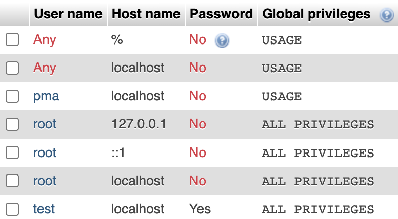

# React + Vite

Ruoke:
1. Please create a new account in phpMyAdmin
, the password is 123456, grant it with all the priviledges.

2. When start the server, run "node server/server.js", instead of "node server.js"

3. Go to http://localhost:8080/get_item to see the result. (Not port 7000)

This template provides a minimal setup to get React working in Vite with HMR and some ESLint rules.

Currently, two official plugins are available:

- [@vitejs/plugin-react](https://github.com/vitejs/vite-plugin-react/blob/main/packages/plugin-react/README.md) uses [Babel](https://babeljs.io/) for Fast Refresh
- [@vitejs/plugin-react-swc](https://github.com/vitejs/vite-plugin-react-swc) uses [SWC](https://swc.rs/) for Fast Refresh
